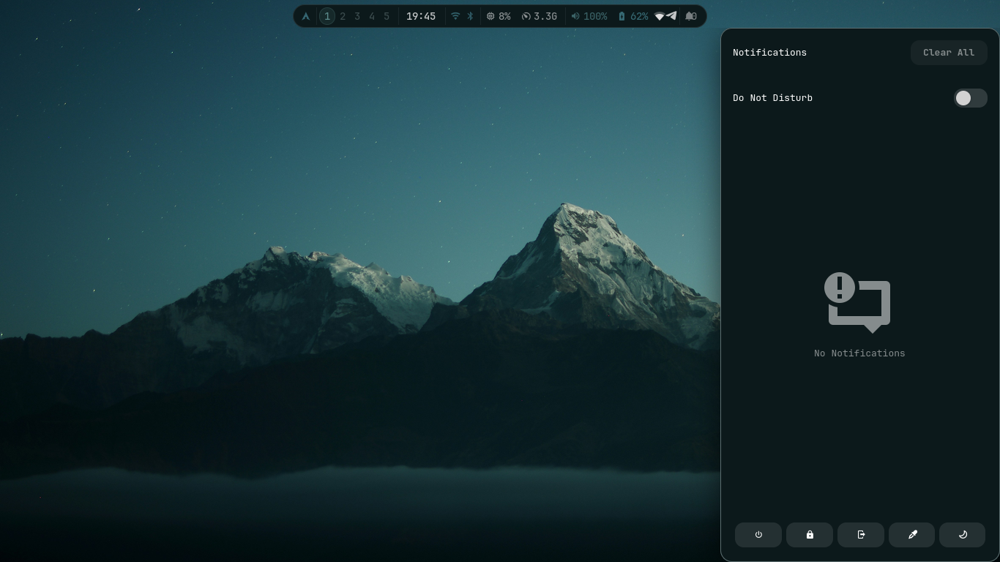
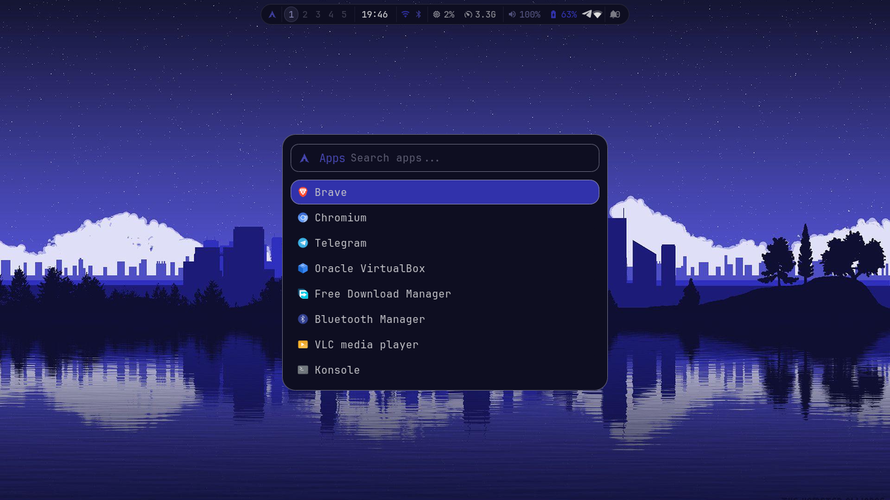
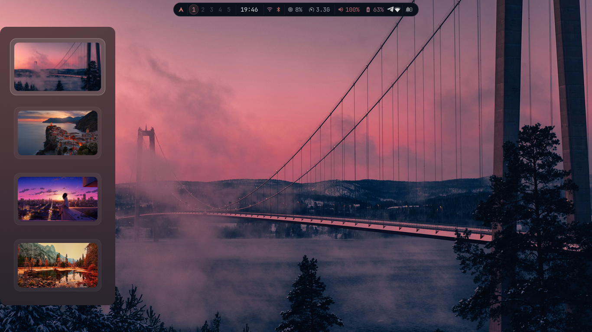

# MASU dotfile

Personal Hyprland desktop configuration with a **matugen-driven color pipeline**. Colors follow the wallpaper automatically across Waybar, Rofi, Kitty, Hyprland, Hyprlock, and Swaync.

**Quick facts**

- **Hardware:** ThinkPad E531 · 1366×768 · Intel Ivy Bridge
- **OS:** Arch Linux
- **Window Manager:** Hyprland 0.55.4
- **Terminal:** Kitty
- **Shell:** Zsh
- **Wallpaper daemon:** [awww](https://codeberg.org/LGFae/awww)
- **Color engine:** [matugen](https://github.com/InioX/matugen)

Prefer a one-command setup instead? Use the
[MASU Hyprland Installer](https://github.com/Maty156/masu-hyprland-installer),
which clones this repo and installs everything for you.

**Contents**

| Folder | Description |
|--------|-------------|
| `hypr/` | Hyprland config, window/layer rules (Lua), animations, hyprlock, hypridle, color-pipeline scripts |
| `waybar/` | Status bar configuration (matugen colors) |
| `rofi/` | App launcher, wallpaper picker, style changer, applets |
| `matugen/` | `config.toml` and per-app color templates |
| `swaync/` | Notification center styling, sounds, scripts |
| `swayosd/` | Volume/brightness OSD styling |
| `kitty/` | Kitty terminal config |
| `cava/` | Audio visualizer config |
| `htop/` | htoprc |
| `wlogout/` | Power menu layout + styling |
| `wallpapers/` | Wallpapers used to generate palettes |

## Quick install

1. Clone the repo (or let the [installer](https://github.com/Maty156/masu-hyprland-installer) do this for you):

```bash
git clone https://github.com/Maty156/dotfile.git
cp -r dotfile/{hypr,waybar,rofi,matugen,swaync,swayosd,kitty,cava,htop,wlogout} ~/.config/
cp -r dotfile/wallpapers ~/wallpapers
```

2. Install required packages (Arch example):

```bash
sudo pacman -S hyprland hyprlock waybar rofi-wayland kitty swaync swayosd \
  awww matugen cava htop xxhash wl-clipboard cliphist thunar grim slurp \
  nm-applet pavucontrol imagemagick jq bc ttf-jetbrains-mono-nerd \
  gtk4 libadwaita gtk-layer-shell
```

3. Install AUR packages (examples):

```bash
yay -S bibata-cursor-theme wlogout
```

`awww` and `matugen` are both in Arch's official `extra` repo now — no AUR needed
for either. On other distros, `cargo install matugen` and
`cargo install --git https://codeberg.org/LGFae/awww awww` are your best bet
until they're packaged.

4. Set your first wallpaper and generate colors:

```bash
awww img ~/wallpapers/wallpaper.jpg
~/.config/hypr/scripts/matugenMagick.sh --dark
```

5. Start Hyprland.

## Dependencies

- `hyprland`, `hyprlock`, `awww`, `matugen`
- `waybar`, `rofi-wayland`, `swaync`, `swayosd`
- `kitty`, `thunar`
- `cava`, `htop`, `wlogout`
- `grim`, `slurp`, `xxhash`, `wl-clipboard`, `cliphist`
- `nm-applet`, `pavucontrol`, `imagemagick`, `jq`, `bc`
- JetBrainsMono Nerd Font (recommended)
- Bibata cursor theme (AUR)

## Color pipeline

Picking a wallpaper (`SUPER+W` → `wallSelect.sh`) drives the whole chain:

```
wallSelect.sh (rofi picker)
        │
        ▼
   awww sets the wallpaper
        │
        ▼
   matugenMagick.sh
        │
        ├──▶ matugen generates the palette from the wallpaper
        │        │
        │        ├──▶ Waybar colors        (matugen template)
        │        ├──▶ Rofi colors          (matugen template)
        │        ├──▶ Kitty colors         (matugen template)
        │        ├──▶ Hyprland border      (matugen template)
        │        └──▶ Hyprlock colors      (matugen template)
        │
        ├──▶ ImageMagick regenerates rofi's cached background images
        └──▶ swaync reloads its config + CSS
```

Unlike pywal, there's no `~/.cache/wal/` intermediate step — matugen writes
each output file directly to the path defined in `matugen/config.toml`.

## Monitor

Default configured for `LVDS-1` at `1366x768@60` — change settings in
`hypr/modules/monitors.conf`.

```ini
monitor = LVDS-1, 1366x768@60, 0x0, 1
```

## Scripts & Autostart

Key helper scripts live in `hypr/scripts/`:

- `wallSelect.sh` — rofi-based wallpaper picker with a checksum-verified
  ImageMagick thumbnail cache; sets the wallpaper via `awww` and hands off to
  `matugenMagick.sh`.
- `matugenMagick.sh` — runs `matugen`, regenerates rofi's cached background
  images, reloads Hyprland, and reloads swaync's config/CSS.
- `waybarSelect.sh` — waybar style picker.
- `refresh.sh` — reloads the desktop (waybar/swaync/etc.) without a full
  Hyprland restart.
- `wlogout.sh` — launches the power menu.
- `airplaneMode.sh`, `backlight.sh`, `sounds.sh`, `songdetail.sh` — misc
  hardware/media helpers.

Keybindings live in `hypr/modules/keybinds.conf` — a few highlights:

- `bind = $mainMod, SPACE, exec, $rofiScripts/launcher` — app launcher
- `bind = $mainMod, W, exec, $deskScripts/wallSelect.sh` — wallpaper picker
- `bind = $mainMod, A, exec, swaync-client --open-panel` — notification panel
- `bind = $mainMod SHIFT, M, exec, $deskScripts/wlogout.sh` — power menu

You can re-run the color pipeline manually at any time:

```bash
~/.config/hypr/scripts/matugenMagick.sh --dark
```

## Screenshots

> These screenshots predate the v3.0 matugen/rofi/swaync migration and still
> show the old wofi/dunst look — kept here for now, will swap in updated ones.






## Credits

This rice builds on top of several community Hyprland projects. Full credit
to the original authors — see [`CREDITS.md`](CREDITS.md) for the complete
list of sources and what's original MASU work on top.

## Contributing

If you want to contribute adjustments or fixes, open a PR. Configs are
opinionated; please test changes locally before proposing.
