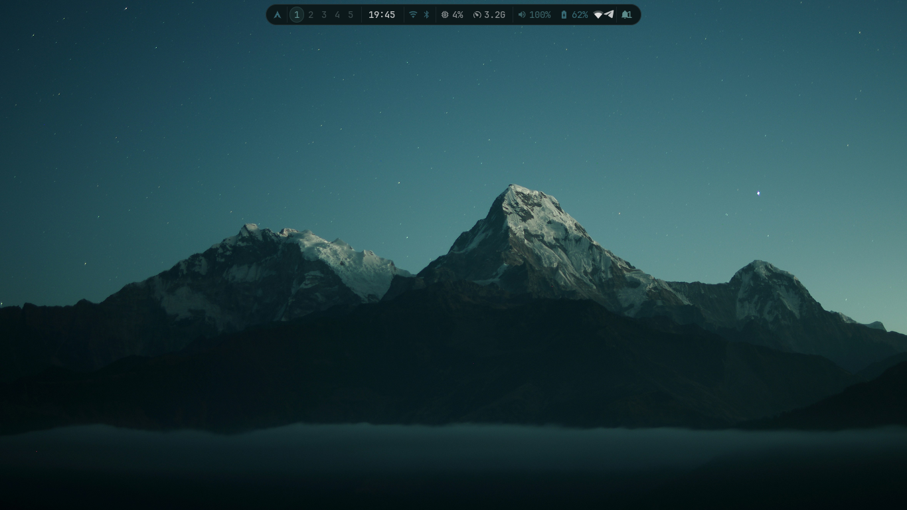

# MASU .config

Personal Hyprland desktop configuration with a pywal-driven color pipeline. Colors follow the wallpaper automatically across Waybar, Rofi, Swaync, Wofi, Dunst, Hyprlock, and related scripts.

**Quick facts**

- **Hardware:** ThinkPad E531 · 1366×768 · Intel Ivy Bridge
- **OS:** Arch Linux
- **Window Manager:** Hyprland
- **Terminal:** Kitty
- **Shell:** Zsh

**Contents**

This repo contains configuration and helper scripts for a themed Hyprland setup.

| Folder | Description |
|--------|-------------|
| `hypr/` | Hyprland config, animations, hyprlock, color pipeline scripts |
| `waybar/` | Status bar configuration (pywal colors) |
| `rofi/` | Rofi themes and palettes |
| `swaync/` | Notification center styling and scripts |
| `kitty/` | Kitty terminal config |
| `matuwall/` | Wallpaper manager config and scripts |
| `wallpapers/` | Example wallpapers used to generate palettes |
| `waybar/themes/` | Waybar theme variants |

## Quick install

1. Clone into `~/.config`

```bash
git clone https://github.com/Maty156/.config.git ~/.config
```

2. Install required packages (Arch example):

```bash
sudo pacman -S hyprland hyprlock waybar rofi kitty dunst swaync wob wofi thunar grim slurp \
  nm-applet blueman pavucontrol python-pywal
```

3. Install AUR packages (examples):

```bash
yay -S hyprpaper awww matuwall ttf-jetbrains-mono-nerd papirus-icon-theme bibata-cursor-theme
```

4. Symlink pywal Rofi colors (optional):

```bash
ln -sf ~/.cache/wal/colors-rofi.rasi ~/.config/rofi/colors-rofi.rasi
```

5. Generate colors from a wallpaper:

```bash
wal -i /path/to/your/wallpaper.jpg
```

6. Start Hyprland.

## Dependencies

- hyprland, hyprlock, hyprpaper, awww, matuwall
- waybar, rofi, swaync, wofi, dunst, wob
- kitty, thunar
- python-pywal, grim, slurp
- nm-applet, blueman, pavucontrol
- JetBrainsMono Nerd Font (recommended)
- Papirus icon theme, Bibata cursor theme

## Color pipeline

When the wallpaper changes via `matuwall` the scripts generate colors and propagate them across the components:

```
matuwall → awww-wrapper.sh → wallpaper-colors.sh
                                    ↓
                               wal -i <wallpaper>
                                    ↓
                     ┌─────────────┼──────────────┐
                  waybar        rofi           swaync
                  wofi          dunst          hyprlock
                  wob           hyprland       SDDM
```

`wal-watcher.sh` can also run in the background to catch wallpaper changes and reapply palettes.

## Monitor

Default configured for `LVDS-1` at `1366x768@60` — change settings in `hypr/hyprland.conf`.

```ini
monitor = LVDS-1, 1366x768@60, 0x0, 1
```

## Scripts & Autostart

Key helper scripts live in `hypr/scripts/` and are used by the autostart entries in `hypr/hyprland.conf`.

- `hypr/scripts/wallpaper-colors.sh`: applies `wal -i <wallpaper>` and copies generated color files to component configs (Waybar, Wofi, Dunst, Wob, Hyprland), updates hyprlock background, and reloads affected services.
- `hypr/scripts/wal-watcher.sh`: daemon that watches `awww` for wallpaper changes and runs the full pywal color pipeline automatically.
- `hypr/scripts/awww-wrapper.sh`: wrapper used when setting wallpapers manually via `awww`.
- `hypr/scripts/hyprlock_wall.sh` and `hypr/scripts/sddm-colors.sh`: helpers for lock/SDDM backgrounds.
- `hypr/scripts/spotify-toggle.sh`: toggles the Spotify scratchpad used by the config.

Autostart and useful bindings (see `hypr/hyprland.conf`):

- `exec-once = uwsm app -- matuwall --daemon` — starts the matuwall daemon for wallpaper selection.
- `exec-once = bash -c "sleep 1 && wal -R -q && bash ~/.config/hypr/scripts/wal-watcher.sh"` — restores the last wal palette and starts the watcher on login.
- `bind = $mainMod, W, exec, matuwall --toggle` — quick keybinding to open/close matuwall.

You can test the pipeline manually by running:

```bash
~/.config/hypr/scripts/wallpaper-colors.sh /path/to/wallpaper.jpg
```

Or start the watcher directly for live updates:

```bash
~/.config/hypr/scripts/wal-watcher.sh &
```

## Screenshots

Screenshots of the setup are included below (in `assets/screenshots/`). Click any image to open the file. Images are shown at a reduced width for readability.

- **Notification / Waybar:**

  

- **Rofi launcher:**

  

- **Wallpaper chooser (Matuwall thumbnails):**

  

- **Wallpaper changer / picker:**

  

How to add screenshots:

1. Place images in `assets/screenshots/`.
2. Recommended resolution: 1280×720 (or scaled down).
3. Commit and push; the README will show them automatically.

## Contributing

If you want to contribute adjustments or fixes, open a PR. Configs are opinionated; please test changes locally before proposing.

